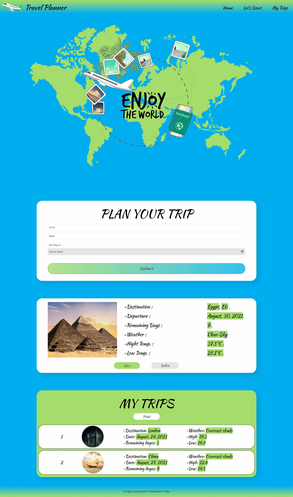

# Project 5: FEND Capstone Project: Travel App


## Project Overview
This is the Capstone Project in Udacity's Front End Development Nanodegree.
This project is a web tool that aims to help users plan for their trips and get the required information about the destination 
like weather and an image of the location using information obtained from external APIs. 
_____________________________________________________________________________________________________________
## Tech stack


  
  

  
  
  
  
  

### The practical knowledge that you will gain through this project:
- Java Script Coding and DOM.
- Sass styles
- Creating layouts and page design
- Setting up Webpack 
- Webpack Loaders and Plugins
- Dev and Prod modes
- Service workers
- Express
- Using APIs and creating requests to external urls
- Basic Jest testing
_____________________________________________________________________________________________________________
## Hosting
Live Demo : https://travel-planner-0.herokuapp.com/
_____________________________________________________________________________________________________________
## Setting up the Project
1. Fork the project Github repository.
2. Clone it into your local machine OR download the zip file locally.
3. Get inside the project directory using `cd` command.
4. install all dependencies using `npm install` command.
_____________________________________________________________________________________________________________
## APIs
In this project I am using three APIs :
- [Geonames API](http://www.geonames.org/export/web-services.html)
- [DarkSky API](https://darksky.net/dev)
- [Pixabay API](https://pixabay.com/api/docs/)<br>
To make sure that the project will work with you correctly. You need to register to these APIs and get your credential Keys.
_____________________________________________________________________________________________________________
## Run the project
There is two environments (Mode) setup for this project:
> Development environment(Mode)
if you are going to apply some changes to the project and want the server to automatically re-build the application and reloads the page.
So you should use this command:
```
npm run build-dev
``` 
and it will open a new window in your browser with the app running on `localhost:3300`

> Production environment(Mode)
if you are going to run the project for production (with express server). 
So you should use these commands:
```
npm run build-prod
npm run start
```
and it will open a new window in your browser with the app running locally on port `localhost:7000`
_____________________________________________________________________________________________________________
## Project Testing
> This project uses the Jest framework that provides us the ability to create, and run tests.
So you should use this command to run your tests:
```
npm run test
```
_____________________________________________________________________________________________________________

## Project Preview  
 
_____________________________________^MOHAMED_SABER_SAYED_HAFEZ^____________________________________________
